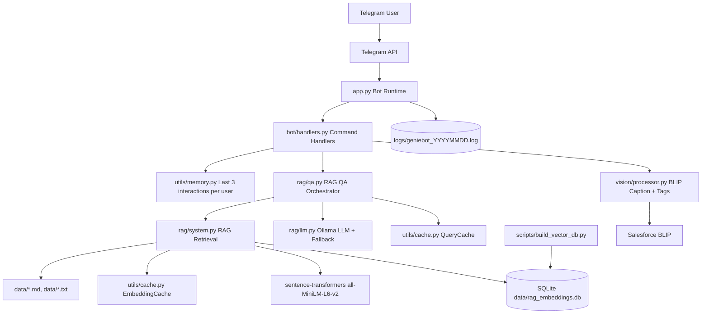

# GenieBot: RAG & Vision AI Assistant

GenieBot is a production-ready Telegram bot that supports:
- RAG-based question answering from local documents
- Image captioning and tags from uploaded images

It uses only open-source/local models and APIs.

## 1. How to Run Locally

### Option A: Python (recommended)

1. Create and activate virtual environment.

Windows:
```powershell
python -m venv venv
.\venv\Scripts\Activate.ps1
```

macOS/Linux:
```bash
python -m venv venv
source venv/bin/activate
```

2. Install dependencies:
```bash
pip install -r requirements.txt
```

3. Start Ollama and pull models:
```bash
ollama serve
ollama pull gemma3:4b
ollama pull mistral
ollama pull tinyllama
```

4. Configure environment:
```bash
cp .env.example .env
```

Set at least:
```env
TELEGRAM_BOT_TOKEN=your_token_here
OLLAMA_BASE_URL=http://localhost:11434
OLLAMA_MODEL=gemma3:4b
OLLAMA_MODEL_PRIORITY=mistral,phi3
OLLAMA_FALLBACK_MODELS=tinyllama
LOG_LEVEL=INFO
```

5. (Optional) Prebuild persistent vector DB:
```bash
python scripts/build_vector_db.py --data-dir data --db-path data/rag_embeddings.db
```

6. Run bot:
```bash
python app.py
```

### Option B: Docker Compose

1. Ensure Ollama is running on host machine.
2. Configure `.env` as above.
3. Run:
```bash
docker compose up --build -d
```

4. Stop:
```bash
docker compose down
```

## 2. Models and APIs Used

### Bot Interface API
- Telegram Bot API via `python-telegram-bot`

### RAG Models
- Embedding model: `sentence-transformers/all-MiniLM-L6-v2`
- LLM generation: Ollama local models
  - Primary: `gemma3:4b`
  - Priority fallback list: `mistral, phi3`
  - Runtime fallback: `tinyllama`

### Vision Model
- `Salesforce/blip-image-captioning-base` (Hugging Face Transformers)

### Vector Storage
- Persistent SQLite database: `data/rag_embeddings.db`
- Embeddings are persisted and reused across restarts.

## 3. System Design Diagram

Diagram source file:
- `docs/diagrams/system-design.mmd`

Mermaid preview:



## 4. Demo Screenshots / GIF

Add demo assets in:
- `docs/demo/`

Suggested files:
- `docs/demo/01-start.png`
- `docs/demo/02-ask.png`
- `docs/demo/03-image.png`
- `docs/demo/04-summarize.png`
- `docs/demo/demo.gif`

Then reference them in this README:

```markdown


```

## 5. Commands

- `/start`
- `/help`
- `/ask <query>`
- `/image`
- `/summarize [chat|image]`

## 6. Notes

- Top-k retrieval currently uses `k=3`.
- User memory keeps the last 3 interactions per user.
- Persistent DB is auto-synced at startup if documents/config change.
