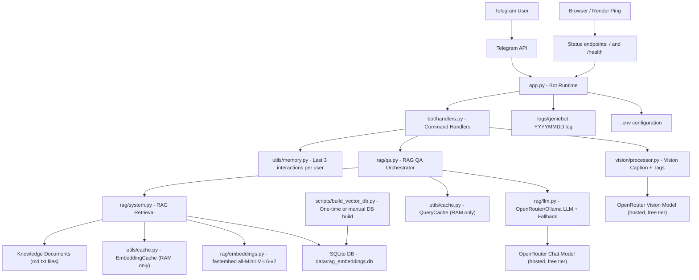

# GenieBot - RAG + Vision Telegram Assistant

[](https://github.com/iamvisheshsrivastava/geniebot/actions/workflows/tests.yml)

GenieBot is a Telegram bot that answers questions against a small local document set (RAG), captions and tags photos, and can summarize your last chat or image interaction. I built it to run entirely on free tiers - OpenRouter for the LLM/vision calls, fastembed for embeddings (no torch, no GPU), and SQLite for the vector store - so it comfortably fits on Render's free instance.

## Quick Access

- Telegram bot: [@Hello_Genie_Bot](https://t.me/Hello_Genie_Bot)
- Service check: [https://geniebot-s98h.onrender.com/health](https://geniebot-s98h.onrender.com/health) to confirm whether the bot service is running
- Hosted on Render's free tier (see **Deploy (free tier)** below); the previous DigitalOcean droplet deployment has been retired

## Highlights

- RAG retrieval with persistent embeddings in SQLite
- Query and embedding caches in RAM for fast repeated calls
- Vision pipeline for image caption + tags (via a hosted vision model, no local weights)
- User memory that keeps the last 3 interactions per user
- Health/status page at `/` and `/health`

## Tech Stack

- Python 3.10+
- python-telegram-bot
- OpenRouter (`z-ai/glm-4.6` for chat, `z-ai/glm-4.6v` for vision) is the default and what's actually deployed on Render. `LLM_PROVIDER=ollama` still works for local dev if you'd rather point at a model running on your own machine, but the vision pipeline always goes through OpenRouter regardless of that setting.
- fastembed / sentence-transformers/all-MiniLM-L6-v2 (embeddings, ONNX-based, no torch)
- SQLite (`data/rag_embeddings.db`)

## Current Runtime Settings

- retrieval top_k: 2
- chunk_size: 200
- max_tokens: 800 for `/ask` and `/summarize`, 400 for image captioning (higher than you'd expect for a 2-4 sentence answer, because GLM-4.6 is a reasoning model and spends part of that budget on hidden reasoning before it writes the visible response — too low and you get an empty reply)
- user history: last 3 interactions per user

## Project Structure

```text
app.py                    # Bot bootstrap + status server
bot/handlers.py           # Telegram command handlers
rag/system.py             # Chunking, embedding, retrieval, SQLite persistence
rag/qa.py                 # QA orchestration and prompt flow
rag/llm.py                # OpenRouter + Ollama clients with model fallback handling
rag/embeddings.py         # fastembed wrapper (no torch dependency)
vision/processor.py       # Image captioning via a hosted OpenRouter vision model
utils/cache.py            # QueryCache + EmbeddingCache (RAM)
utils/memory.py           # Per-user short history (RAM)
utils/logger.py           # File + console logging
data/                     # Knowledge documents + SQLite DB file
media/                    # Assignment screenshots used below
docs/diagrams/system-design.mmd
```

## Setup and Run (local)

### 1) Create and activate virtual environment

Windows (PowerShell):

```powershell
python -m venv .venv
.\.venv\Scripts\Activate.ps1
```

macOS/Linux:

```bash
python -m venv .venv
source .venv/bin/activate
```

### 2) Install dependencies

```bash
pip install -r requirements.txt
```

### 3) Configure environment

Create `.env` from `.env.example`. By default `LLM_PROVIDER=openrouter`, which needs no local model server:

```env
TELEGRAM_BOT_TOKEN=your_token_here
LLM_PROVIDER=openrouter
OPENROUTER_API_KEY=your_openrouter_api_key
OPENROUTER_MODEL=z-ai/glm-4.6
OPENROUTER_VISION_MODEL=z-ai/glm-4.6v
LOG_LEVEL=INFO
PORT=8080
```

A word of caution on `OPENROUTER_MODEL`/`OPENROUTER_VISION_MODEL`: these are free-tier model IDs, and OpenRouter does retire them from time to time (that's what happened to the model this bot originally shipped with - see closed issue [#8](https://github.com/iamvisheshsrivastava/geniebot/issues/8)). If `/ask` or `/summarize` start failing in production, check https://openrouter.ai/models?max_price=0 for what's still free before assuming it's a code problem.

To use a local Ollama server instead, set `LLM_PROVIDER=ollama` and configure `OLLAMA_BASE_URL` / `OLLAMA_MODEL` (see `.env.example`); note the vision pipeline always calls OpenRouter regardless of `LLM_PROVIDER`.

### 4) Optional: prebuild the embedding DB

```bash
python scripts/build_vector_db.py --data-dir data --db-path data/rag_embeddings.db --chunk-size 200 --chunk-overlap 50
```

### 5) Run the bot

```bash
python app.py
```

## Testing

There's a pytest suite (47 tests, runs in CI on every push/PR via `.github/workflows/tests.yml`) covering the parts that would actually leak memory, misrank retrieval, or break silently on a model outage:

- `RateLimiter`, `UserMemory`, and the two RAM caches (`EmbeddingCache`, `QueryCache`)
- `rag/system.py` - document chunking/overlap, the SQLite index-signature invalidation logic, and cosine-similarity retrieval ranking
- `rag/llm.py` - the Ollama/OpenRouter fallback-model chains and the retry-on-error heuristics, fully mocked (no live Ollama/OpenRouter calls)

```bash
pip install -r requirements-dev.txt
pytest tests/
```

It still doesn't touch the Telegram handlers themselves - those depend on `python-telegram-bot`'s update objects and would need a different mocking approach.

## Deploy (free tier)

This repo includes a `Dockerfile` and `render.yaml` for a one-click Render deployment:

1. On [Render](https://render.com), choose **New > Blueprint** and point it at this repo (`render.yaml` will be picked up automatically).
2. Set the required secrets in the Render dashboard: `TELEGRAM_BOT_TOKEN` and `OPENROUTER_API_KEY`.
3. Deploy. Render auto-redeploys on every push to `main` (`autoDeployTrigger: commit`).
4. Confirm it's running via `<your-render-url>/health`.

The bot itself doesn't need inbound HTTP (it long-polls Telegram), the status server just satisfies Render's free-tier requirement that the service bind to `$PORT`.

## Bot Commands

- `/start` - quick intro and commands
- `/help` - usage guidance
- `/ask <question>` - document-grounded answer
- `/image` - upload image for caption + tags
- `/summarize [chat|image]` - summarize latest interaction

## Demo Screenshots

### Start


### Ask


These are example `/ask` queries that fetch information from your loaded documents and then answer:
- `/ask What is the return policy?`
- `/ask What are the pricing plans and included features?`
- `/ask What are the support hours and escalation process?`
- `/ask How do I reset my account password?`
- `/ask What are the main security/compliance points?`

### Image


### Summarize


## Architecture Diagram

Source: `docs/diagrams/system-design.mmd`



## Storage and Caching

- Persistent: document chunk embeddings in SQLite (`data/rag_embeddings.db`)
- RAM only: QueryCache, EmbeddingCache, user interaction history
- Logs: `logs/geniebot_YYYYMMDD.log` (daily file name, no auto-rotation cleanup)

## Notes and Known Limitations

- The RAG prompt is tuned for short, grounded answers (2-4 sentences) rather than long-form responses - it's a Telegram bot, not a research assistant.
- Repeated questions are served from the in-memory query cache, so they come back instantly, but the cache doesn't persist across restarts.
- Rate limiting and user memory are single-process, in-memory structures (see `utils/cache.py` and `utils/memory.py`). That's fine for the one Render instance this actually runs on, but it wouldn't hold up if this were ever scaled to multiple workers.
- `/health` only checks that the process is alive, not that OpenRouter is actually reachable or that the configured model still exists - that gap is what let issue [#8](https://github.com/iamvisheshsrivastava/geniebot/issues/8) go unnoticed for a while.
