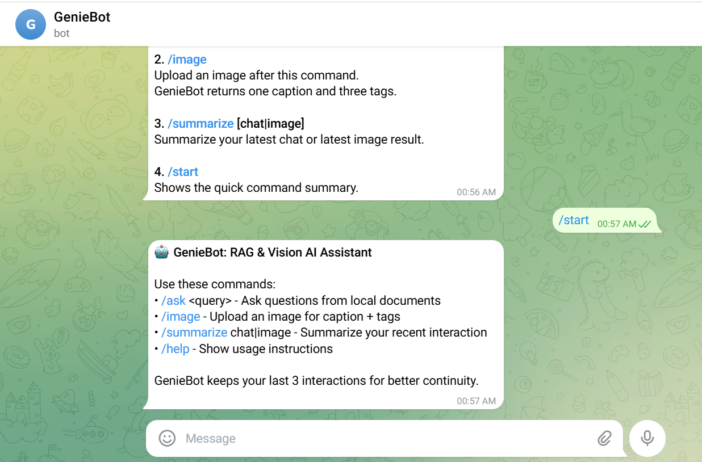
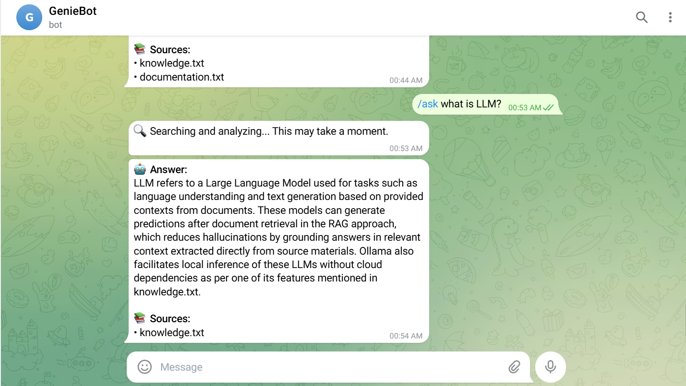
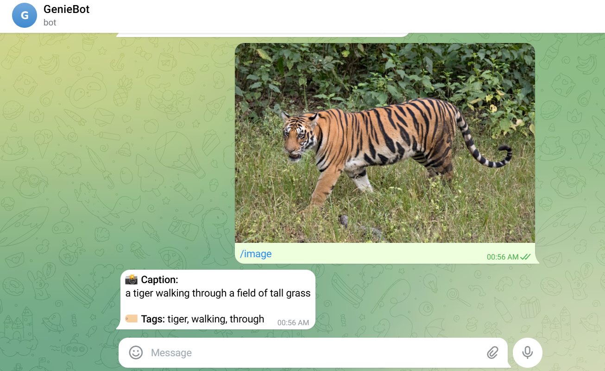
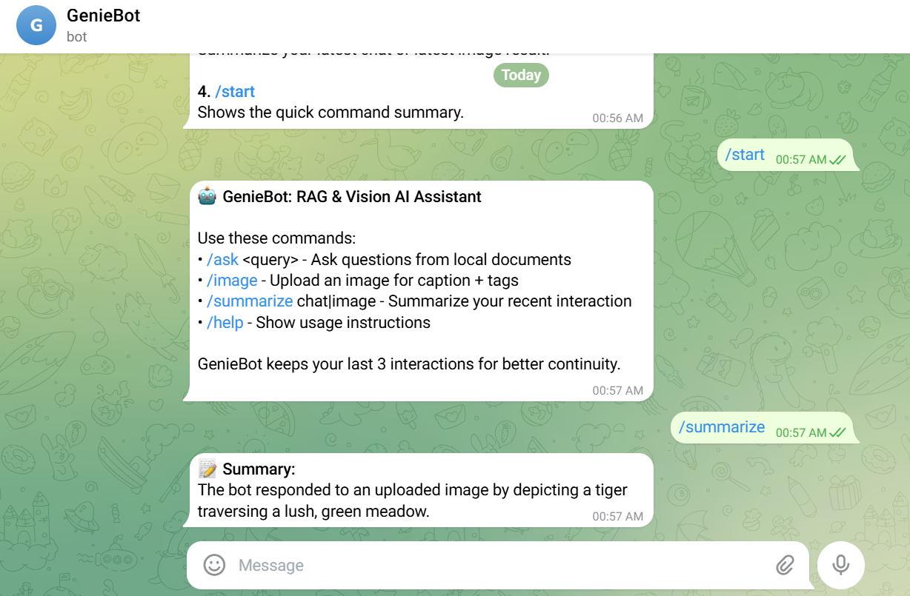

# GenieBot - RAG + Vision Telegram Assistant

GenieBot is a local-first Telegram assistant that supports:
- document-grounded Q&A with RAG
- image captioning with tags
- quick summary of the latest chat or image interaction

It uses Ollama for generation, SentenceTransformers for embeddings, BLIP for vision, and SQLite for persistent vector storage.

## Highlights

- RAG retrieval with persistent embeddings in SQLite
- Query and embedding caches in RAM for fast repeated calls
- Vision pipeline for image caption + tags
- User memory that keeps the last 3 interactions per user
- Health/status page at `/` and `/health`

## Tech Stack

- Python 3.10+
- python-telegram-bot
- Ollama (local LLM runtime)
- sentence-transformers/all-MiniLM-L6-v2 (embeddings)
- Salesforce/blip-image-captioning-base (vision)
- SQLite (`data/rag_embeddings.db`)

## Current Runtime Settings

- retrieval top_k: 2
- chunk_size: 200
- max_tokens: 250
- user history: last 3 interactions per user

## Project Structure

```text
app.py                    # Bot bootstrap + status server
bot/handlers.py           # Telegram command handlers
rag/system.py             # Chunking, embedding, retrieval, SQLite persistence
rag/qa.py                 # QA orchestration and prompt flow
rag/llm.py                # Ollama client + model fallback handling
vision/processor.py       # Image captioning and tag extraction
utils/cache.py            # QueryCache + EmbeddingCache (RAM)
utils/memory.py           # Per-user short history (RAM)
utils/logger.py           # File + console logging
data/                     # Knowledge documents + SQLite DB file
media/                    # Assignment screenshots used below
docs/diagrams/system-design.mmd
```

## Setup and Run

### 1) Create and activate virtual environment

Windows (PowerShell):

```powershell
python -m venv .venv
.\.venv\Scripts\Activate.ps1
```

macOS/Linux:

```bash
python -m venv .venv
source .venv/bin/activate
```

### 2) Install dependencies

```bash
pip install -r requirements.txt
```

### 3) Start Ollama and pull models

```bash
ollama serve
ollama pull gemma3:4b
ollama pull mistral
ollama pull tinyllama
```

### 4) Configure environment

Create `.env` from `.env.example` and set:

```env
TELEGRAM_BOT_TOKEN=your_token_here
OLLAMA_BASE_URL=http://localhost:11434
OLLAMA_MODEL=gemma3:4b
OLLAMA_MODEL_PRIORITY=mistral,phi3
OLLAMA_FALLBACK_MODELS=tinyllama
LOG_LEVEL=INFO
PORT=8080
```

### 5) Optional: prebuild the embedding DB

```bash
python scripts/build_vector_db.py --data-dir data --db-path data/rag_embeddings.db --chunk-size 200 --chunk-overlap 50
```

### 6) Run the bot

```bash
python app.py
```

## Bot Commands

- `/start` - quick intro and commands
- `/help` - usage guidance
- `/ask <question>` - document-grounded answer
- `/image` - upload image for caption + tags
- `/summarize [chat|image]` - summarize latest interaction

## Demo Screenshots

### Start


### Ask


### Image


### Summarize


## Architecture Diagram

Source: `docs/diagrams/system-design.mmd`

```mermaid
flowchart TD
    U[Telegram User] --> TG[Telegram API]
    TG --> APP[app.py\nBot Runtime]
    WEB[Browser/Render Ping] --> STATUS[/ and /health status server]
    STATUS --> APP

    APP --> H[bot/handlers.py\nCommand Handlers]
    H --> MEM[utils/memory.py\nLast 3 interactions per user]
    H --> QA[rag/qa.py\nRAG QA Orchestrator]
    H --> VISION[vision/processor.py\nBLIP Caption + Tags]

    QA --> RAG[rag/system.py\nRAG Retrieval]
    QA --> LLM[rag/llm.py\nOllama LLM + Fallback]
    QA --> QCACHE[utils/cache.py\nQueryCache (RAM only)]

    RAG --> DOCS[data/*.md, data/*.txt\nKnowledge Documents]
    RAG --> ECACHE[utils/cache.py\nEmbeddingCache (RAM only)]
    RAG --> ST[sentence-transformers\nall-MiniLM-L6-v2]
    RAG --> SQLITE[(SQLite DB\ndata/rag_embeddings.db)]

    BLD[scripts/build_vector_db.py\nOne-time / manual DB build] --> SQLITE
    VISION --> BLIP[Salesforce BLIP\nImage Caption Model]

    APP --> LOGS[(logs/geniebot_YYYYMMDD.log)]
    APP --> ENV[.env configuration]
```

## Storage and Caching

- Persistent: document chunk embeddings in SQLite (`data/rag_embeddings.db`)
- RAM only: QueryCache, EmbeddingCache, user interaction history
- Logs: `logs/geniebot_YYYYMMDD.log` (daily file name, no auto-rotation cleanup)

## Assignment Notes

- This project runs without Docker.
- RAG is optimized for concise answers with grounded context.
- Repeated same questions are served from in-memory query cache when available.
